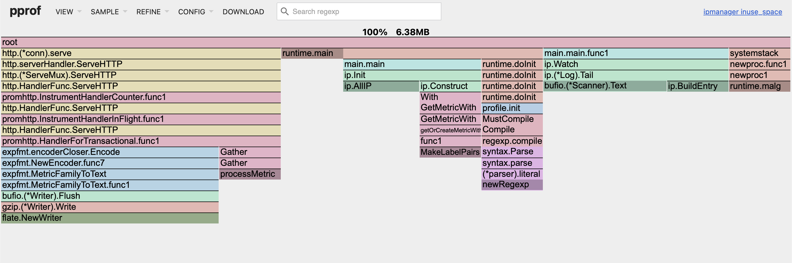
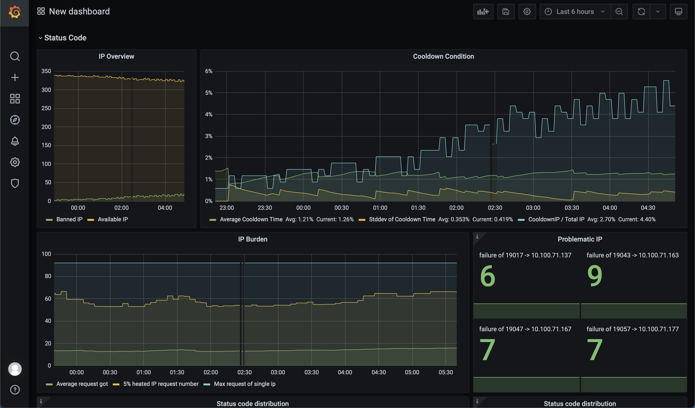

# IPManager

This is a proxy and manage layer used for ip-pool based on nginx.

In our case, our ip-pool is deployed on a nginx server with hundreds of IPs, who plainly takes proxy and sends out requests through one of its IP.

But managing IP availabiliy from nginx is restricted, this is what this program used for.

IPManager Features:

- Easy and small. Heap consumption managing 300 IPs with 1000 * 300 logs:

- Stateless, easy to scale. No database required. All the status are stored in nginx log.

## Introduction

This is a monitor and load-balancer for ip-pool with huge amount of ip.

`ipmanager` is parsing `accesslog` of `nginx` with regex to fetch history of each ip, and load balance requests to available IPs dynamically and apparently.

First, with `config.UpstreamConfPath` given, the program would read and parse ips to build a full ip list during initialization. And it scans `config.AccessLogPath` for requests behavior.

Scanned request records are reserved in `IP.IP.History []*Entry` and can be access with `GET HOST.com/probe`. 
Every `config.ScanInterval` time the program will scan the log for newly incoming requests logs and update the history of each ip as well as available IP list to tune its load-balancing strategy.

With request comes in, the program select an IP and send it to the port

At will, you'll possibly be able to take a look and analyse the behavior of upstream ips with promethuse and your favorate visualization plane.

## Deployment

Build from source and run with:
```bash
cd ipmanager
go version
env GO111MODULE=on go build -o ipmanager
./ipmanager --config [absolute/full/path/to/config.json]
```
Note: 
1. This package by default requires go 1.18 or higher
2. For nginx log is protected by default, you may want to run it with sudo.

At this time, `/metric` router for prometheus is automatically enabled. You can access it with `HOST.com/metric` and use your favorite visualization plane to monitor the behavior of upstream ips.

Add following config to your `prometheus.yml`.
```bash 
- job_name: 'ipmanager'
  metrics_path: '/metric'
  scrape_interval: 60s
  static_configs:
  - targets: ['HOST.com:PROBE_PORT']
```

And reboot prometheus to apply. If you are using grafana, you can easily adopt the dashboard from `ipmanager/additional/grafana-dashboard.json`.



### Configuration
Example configuration file built in with default value:
```json
{
  "mode": "serve",
  "debug": true,
  "probe_port": "9095",
  "proxy_port": "9096",
  "next": "127.0.0.1",
  "scan_interval_min": 5,
  "access_log_path": "/var/log/nginx/host.access.log",
  "upstream_conf_path": "/etc/nginx/conf.d/001-upstream.conf",
  "max_history_log_each_ip": 1000,
  "max_cool_down_log_each_ip": 1000,
  "cool_down_min": 10,
  "dial_timeout": 15,
  "max_connection_timeout": 100,
  "strategy": "consecutive",
  "consecutive_failure": 3
}
```

- `mode`: Enum of `serve` and `parse`.
    - `parse`: The program parses the log after last rotate and continue to serve.
    - `serve`: The program do not take a look at the last rotate, but cares only about the later requests. It may take some failure to make the Available IPs converge.
- `debug`: Causes verbose logging.
- `probe_port`: The port for probe. Router `/probe` `/ping` and `/config` is available.
- `next`: The nginx entry of upstreams.
- `max_history_log_each_ip`: The maximum number of history logs for each ip. You are suggested to set this value according to the size of ip pool and available space. 
The size of json you get from curl, you can estimate with formula `max_history_log_each_ip * len(ip_pool) / 10` (KB).

## Usage

Use proxy:
```bash
curl -X [METHOD] yourhost.example.com:proxy_port \
-H "Host: nginxServerHost.example.com"  \
-H "X-Egress-Scheme: https" \
-H "X-Egress-Host: target.example.com[:port]" \
-H "X-Egress-Key: SomeNonEmptyStringForLoadBalance"   \
```

During this request:
- Client `curl` visit ipmanager on yourhost.example.com
- IPmanager select an available ip from the pool, build a tcp connection and transparently send to the nginx server pointed by `next` in config.
- Nginx sends the request to the target server from the IP selected.
- You are done with proxy.


Fetch all ip status:
```bash
curl -X GET youhost.example.com:probe_port/api/ip/history
```

Fetch current config:
```bash
curl -X GET youhost.example.com:probe_port/api/config
```

Trigger renew IP history:
```bash
curl -X POST youhost.example.com:probe_port/api/ip/renew
```

Prometheus metrics:
```bash
curl -X GET youhost.example.com:probe_port/metrics
```

Check performance. You may install pprof first:
```bash
pprof -http=:9099 http://youhost.example.com:probe_port/debug/pprof/(heap|allocs|goroutine|threadcreate|block|mutex)
```

## Parsing

All files it fetched is parsed with regex, and the regex is defined in `ip/scanner.go`. With logging style changes and other possibly change, you may
want to modify the regex by your own.

## Proxying

For now, load-balancing is naive: random. You can extend it on your own.

The proxy is meant to be apparent and supporting only tcp.

## IP Control

IP are classified as:
```azure
Available
Unavailable
```

You may want to control the switching condition of IPs on your own. The control `config.strategy` is defined in `ip/strategy.go` and selected by configuration file.

Fow now, only `consecutive` mode is supported. Which means:
- An ip would be marked as `Unavailable` if it **consecutively** fails `config.consecutive_failure` times in 5 minutes.
- An ip would be marked as `Available` if it has been banned for `config.Cooldown` minutes.

## Extend

You may want to extend:
- Parsing regex in: `ip/scanner.go`
- Load-Balancing strategy: `Web/server.go`
- IP banning and cool down strategy: `ip/strategy.go`

For more extensibility, you can raise an issue to let me know.

## TODO
TODO: Add debug tracing to upstream. Which one has the very last request been sent to?
TODO: Make performance test and tune.
TODO: Fetch history by batches of ip.
TODO: Manually ban or unban certain ip.
